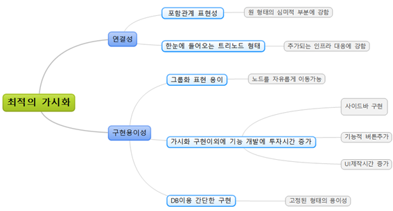
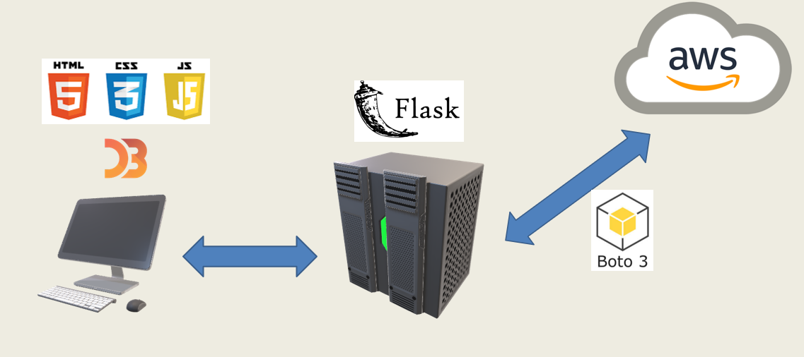
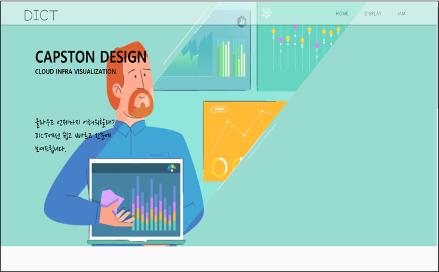
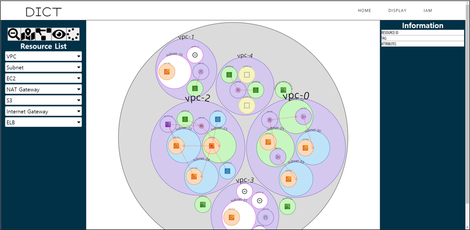
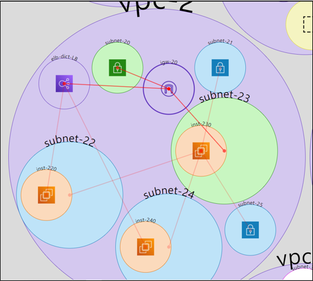
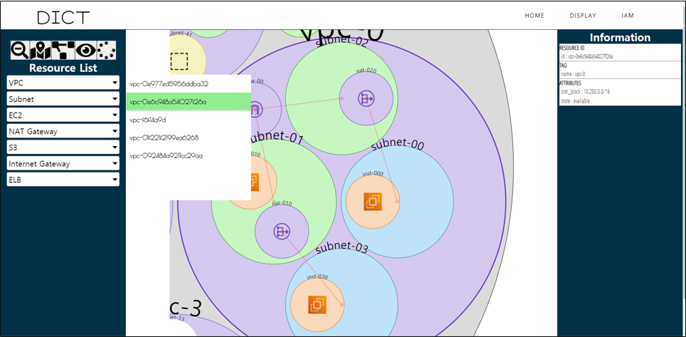
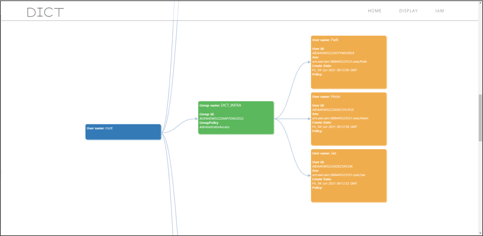

# AWS-visualization
# 클라우드 인프라 가시화 프로젝트
목차        
1. 팀구성, 역할소개
2. 개요 
3. 백엔드 구성
4. 결과, 결론
5. 수상

## 1. 팀구성, 역할
팀명 DICT
|팀원명|역할|
|-----|-------|
|신정규| 인프라 가시화 코드 작성, 인프라 소스 데이터 수집 및 가공, Flask 서버구성|
|정한솔| 가시화된 인프라 나타낼 UI 제작|
|김구연| 인프라 소스 데이터 수집 및 가공, IAM 데이터 수집 및 가공|
|박재헌| AWS 인프라 설계&구축, 인프라 소스 데이터 수집 및 가공, IAM 사용자 계정 계층도 적용 생성|

## 2. 개요
* 프로젝트 주제 선정 이유    

클라우드와 가상화 인프라가 매우 보편적으로 사용되면서 개인이나 조직이 리소스의 유형과 개수를 자유롭게 설정하여 서비스를 운영하게되었다.    

하지만 클라우드 인프라 서비스는 클라우드를 처음 접하는 신규 사용자에게는 인프라를 확인하는 것조차 진입장벽이 높고, 기존의 텍스트와 버튼 위주의 UI로는 구축된 인프라를 유지보수 및 관리하기 불편하다는 어려움이 있다.  

따라서 이와같은 프로젝트를 진행하게 되었다. 

* 프로젝트 목표         

인프라와 인프라 사이의 포함관계, 수평적인 관계까지 
API 연동을 통해 구축된 인프라 혹은 구축하는 인프라를 가시화하여 웹에 표현   
인프라의 구조를 복잡한 구성없이 쉽게 파악할 수 있는 UI/UX 제공

  
설계 목표는 위와같은 트리를 따라 설정하였다. 

* 프로젝트 개발환경, 구현도구    
    
[AWS – Amazon Web Service]       
	AWS는 온라인 전자상거래 회사인 Amazon에서 제공하는 온디맨드(on-demand) 클라우드 컴퓨팅 플랫폼 서비스이다. AWS 클라우드 서비스의 사용자 또는 조직은 인터넷을 통해서 가상서버, 스토리지, 운영체제, 데이터베이스, 네트워크 등 다양한 가상 컴퓨팅 자원들을 사용하여 인프라를 구축할 수 있고 pay-as-you-go 요금제 모델에 따라 자원을 사용한 시간과 용량만큼 월 단위로 비용이 청구된다. 이번 프로젝트에서는 한정된 예산으로 인프라를 저렴하게 구축할 수 있고 클라우드 시장에서 4년 연속 점유율 1위를 차지할 만큼 사람들에게 인지도가 높은 플랫폼인 AWS로 가시화 대상 인프라를 구축했다.

[D3.js 라이브러리]      
	D3.js 라이브러리는 데이터를 기반으로 HTML document를 작성하기 위한 자바스크립트 라이브러리이다. HTML, CSS, SVG 등 웹 표준과 호환성이 뛰어나고 데이터의 포맷과 상관없이 데이터에 대응되는 tag element를 유연하게 지정할 수 있다. 또한 깃허브(Github)로 공개된 오픈소스이고 Observable, block.org 등 규모가 큰 커뮤니티들이 활성화되어 있어서 다양한 가시화 사례들을 참고할 수 있다. 이번 프로젝트에서 D3.js 라이브러리를 활용하여 서버가 AWS로부터 응답으로 받은 인프라 JSON 데이터를 가공하여 가시화 결과물을 생성하는 코드를 작성했다.

[Boto3 – AWS python SDK]         
	AWS 클라우드 서비스는 사용자가 구축한 인프라를 웹 페이지 콘솔, CLI(Command Line Interface)뿐만 아니라 다양한 언어로 작성된 애플리케이션을 통해서 접근할 수 있도록 AWS SDK(Software Development Kit)를 제공한다. AWS SDK를 사용하면 내장된 API를 통해 클라우드에 존재하는 인프라 관련 데이터를 검색조건에 맞게 수집할 수 있다. 이번 프로젝트에서는 python 기반 SDK인 boto3 라이브러리를 사용하여 Flask 서버가 로컬에 등록된 자격증명(Credential)을 기반으로 인프라 데이터를 요청하고 가공하는 코드를 작성했다

[Flask]       
	Flask는 python 기반의 마이크로 웹 프레임워크(micro web framework)로 다른 python 기반 프레임워크인 Django와 달리 특별한 설치 없이 서버에서 실행되는 응용 프로그램을 작성할 수 있고 확장성이 뛰어나 원하는 애플리케이션 기능을 쉽게 추가할 수 있다. 이번 프로젝트에서 짧은 기간 안에 백엔드를 빠르게 구성하기 위한 목적으로 Flask를 선택했고 구축된 서버는 클라이언트 요청의 응답으로 웹 페이지를 생성하거나 API를 통해 AWS 서비스로부터 받은 인프라 데이터를 가공하는 기능을 가진다.

[Visual Studio Code]        
	비주얼 스튜디오 코드는 Microsoft에서 제작한 소스코드 편집기 소프트웨어이다. 여러 프로그래밍 언어로 코드를 작성할 수 있을 뿐만 아니라 다양한 확장 프로그램들을 제공하여 최적화된 개발환경을 만들 수 있다. 또 버전 관리 시스템 Git이 내장되어 있어서 팀원과 소스코드를 쉽게 공유할 수 있는 장점이 있기에 이번 프로젝트를 진행하면서 클라이언트와 서버 쪽 프로그램을 비주얼 스튜디오 코드에서 작성했다.

[Git, Github]       
	Git은 무료, 오픈소스 버전 관리 시스템으로 소프트웨어를 개발하는 팀 내에서 소스코드를 쉽게 공유하고 결합할 수 있는 기능을 제공한다. Github는 사용자마다 Git으로 생성한 변경사항들을 저장하는 서버이다. 이번 프로젝트를 진행하면서 팀원마다 개발할 모듈이 달랐기 때문에 Github organization을 생성했고 소스코드를 새로 작성하거나 수정할 때마다 Github에 업로드하여 각자 개발 진행도와 코드 간의 호환성을 확인했다.

## 3. 백엔드 구성
  
클라이언트, Flask Server, Amazon AWS로 구성되는 형태이다.    
클라이언트에서는 사용자의 브라우저에서 가시화 결과를 확인한다.     
Flask Server는 python으로 작성된 웹 프레임워크인 Flask를 사용한 서버이다.    

전반적인 작업의 흐름은 다음과 같다.    
1. 클라이언트는 사용자의 이벤트에 의해서 가시화 작업을 Flask 서버로 요청한다. 
2. 요청받은 Flask 서버는 로컬에 등록된 AWS 자격증명(Credentials), API 를 통해 AWS 서비스로 인프라 데이터 요청한다. 
3. API 요청을 받은 AWS 서비스는 인프라 데이터를 json 포맷으로 작성하여 Flask 서버로 전달하고 그것을 가공하여 가시화 하는 웹페이지를 생성하고 클라이언트로 URI 응답전송을 하게된다. 
4. 마지막으로 클라이언트는 서버의 응답으로 전달된 페이지를 랜더링하여 사용자에게 인프라 가시화 결과물을 제공한다.

## 4. 결과, 결론
  
구성된 웹페이지의 홈화면

  
디스플레이 버튼을 클릭하면 위와같이 AWS의 인프라를 나타내준다. 

  
리소스와 리소스 사이의 연결관계(수평적)는 선으로 포함된 관계는 중첩된 원으로 나타내었다.

  
왼편의 사이드바를 통해서 리소스 단위의 검색을 수행 후 ZOOM IN 기능을 적용하고 오른편의 사이드바를 통해서 선택된 리소스의 상세정보를 표기한다. 

  
홈화면 우측상단의 IAM을 클릭하면
리소스에대한 접근권한등을 설명한 IAM 조직도를 나타낸다

* 결론      
  
현재 대부분 기업 인프라를 구축하는데 필수가 되어버린 클라우드는 그 필요성이 시간이 지남에 따라 나날이 증가하고 있다. 가상화 인프라가 매우 보편화 되면서 수십, 수백 대의 인프라를 운영하게 되지만 클라우드를 처음 접하는 초보자에게 진입장벽이 높다는 것과 기존의 텍스트나 버튼 위주의 UI로는 구축된 인프라를 유지보수 및 관리하기가 불편하다는 어려움이 있다.       

클라우드의 일부 보안 벤더 혹은 일부 CSP(Cloud Service Provider)에서 제공해주는 도구가 있으나 그 기능이 미약하고 상용보안제품 및 그래프 DB를 사용하여 가시화하는 오픈소스 프로젝트 등이 있으나 기능이 제약적이다. 클라우드 인프라 가시화 프로젝트의 목적은 이 점을 해결하기 위해 API를 연동하여 웹 페이지에 클라우드 인프라 데이터를 가시화하고 인프라의 구조를 복잡한 구성없이 쉽게 파악할 수 있는 UI / UX를 제공하는 것이다.     

가시화 모델을 선정하기 전에 우선 Neo4j graph database를 사용하여 가시화 작업을 수행했다. 열과 행을 가진 테이블 형태로 데이터를 저장하는 관계형 데이터베이스와 달리 그래프 DB는 노드와 간선으로 구성된 그래프 데이터를 처리하는 NoSQL 데이터베이스이다. Neo4j의 데이터베이스 쿼리 언어인 Cypher를 사용하여 가시화 구현에 어려움이 없다는 장점이 있지만 리소스 간의 포함관계를 파악하기 어렵고 네트워크 그래프 모델만 한정된다는 단점이 있다.      

위 단점들로 인해 대안으로 선택한 시각화 도구가 D3.js 라이브러리이다. D3.js 라이브러리는 기존 HTML, CSS, SVG 등 웹 표준을 기반하고 데이터를 document element tag에 대응시켜서 시각화 페이지 문서를 작성하기가 편리하다.  

Observable, bl.ocks.org 등 규모가 있는 커뮤니티에서 다양한 가시화 모델 예시들을 참고하여 선택의 폭이 넓은 것도 또 하나의 장점이다. 적절한 모델을 선정하기 위해 총 4가지(Forced-Directed Graph, Tidy Tree, Sunburst, Zoomable Circle Packing)의 장단점을 분석하여 가시화 프로젝트에 가장 알맞은 모델을 선택하게 되었다.

열거한 4가지 모델 중 Zoomable Circle Packing을 최종 모델로 선정하게 되었다. 이 모델은 네트워크 영역과 그 안에 포함된 리소스들을 모두 원으로 나타낼 수 있다는 점이 특징이고 D3.js 라이브러리에서 제공하는 transition 기능으로 원하는 원을 확대하거나 축소시켜 관찰할 수 있는 기능을 가진다. 또한, 리소스 사이의 포함관계를 직관적으로 파악할 수 있는 장점이 있지만 리소스 사이의 연결관계를 파악하기가 어렵다는 단점이 있다. 이 문제를 해결하기 위해서 기존 packing circle 모델을 구성하는 원 사이의 링크를 추가하여 연결관계를 나타내기로 했다.

이번 프로젝트에서 구현한 것은 크게 인프라 가시화 페이지와 IAM 가시화 페이지이다. 인프라 가시화 페이지에서는 구축된 인프라의 구조뿐만 아니라 구성 리소스만 표시할 수 있는 리소스 단위검색 기능, 원하는 리소스에 대응되는 원으로 확대되면서 사이드바로 리소스 정보를 확인할 수 있는 zoom in/out 기능 그리고 가시화 결과물을 구성하는 원들을 마우스로 옮길 수 있는 drag/drop 기능을 제공한다.

IAM 가시화 페이지에서는 구축된 인프라에 등록된 IAM 보안정책과 관련된 정보들을 보여준다. IAM은 Identity and Access Management의 약자로 AWS 자격증명에 기반하여 리소스에 대한 접근을 안전하게 제어하는 보안 서비스이다. IAM 페이지에서는 인프라를 관리하는 인원들의 계정마다 부여된 권한과 관련된 정보를 조직도로 가시화한다. 

## 5. 수상

